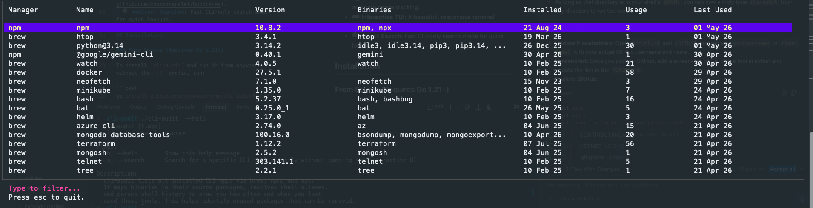

# cli-audit 🔍

A high-performance CLI tool to audit your installed applications across multiple package managers. It helps you identify unused packages by mapping binaries to their source packages and analyzing your shell history.



## Features

- 🚀 **Multi-Manager Support**: Audits packages from **Homebrew**, **NPM (global)**, and **APT**.
- 📊 **Usage Analytics**: Automatically parses `.zsh_history` and `.bash_history` to calculate how often and when you last used each tool.
- 🔗 **Binary Mapping**: Intelligently links executable binaries back to their parent packages.
- 🐚 **Alias Resolution**: Resolves shell aliases to ensure accurate usage tracking.
- ⌨️ **Interactive TUI**: A beautiful, responsive terminal interface powered by [Bubble Tea](https://github.com/charmbracelet/bubbletea).
- 🔍 **Direct Search**: Fast CLI-only search mode for quick lookups.

## Privacy & Security

**`cli-audit` is 100% secure and fully local.** 
- **No Data Sharing:** It does not send any data over the internet. There are no analytics, telemetry, or network calls of any kind.
- **Local Processing:** Your shell history (`.zsh_history`, `.bash_history`) and installed packages are read and processed entirely on your local machine.

## Installation

### From Source (Requires Go 1.21+)

To install `cli-audit` and run it from anywhere without the `./` prefix, run:

```bash
go install github.com/brtkrclr/cli-audit@latest
```

Make sure your `$GOPATH/bin` (usually `~/go/bin`) is in your `$PATH`.

### Manual Build

```bash
git clone https://github.com/brtkrclr/cli-audit.git
cd cli-audit
go build -o cli-audit
# To install locally:
go install .
```

## Usage

### Interactive Mode
Simply run the command to open the interactive TUI:
```bash
cli-audit
```
- **Type** to filter the list in real-time.
- **Arrow Keys** to scroll.
- **Esc** to quit.

### Search Mode
Search for a specific tool directly without entering the TUI:
```bash
cli-audit search <query>
# or
cli-audit -s <query>
```

## Example Output

```text
┌──────────────────────────────────────────────────────────────────────────────────────────────────────────────────────────────
│ Manager    Name                         Version         Binaries                  Installed       Usage      Last Used       
│───────────────────────────────────────────────────────────────────────────────────────────────────────────────────────────── 
│ npm        npm                          10.8.2          npm, npx                  21 Aug 24       3          01 May 26       
│ brew       htop                         3.4.1           htop                      19 Mar 26       1          01 May 26       
│ brew       python@3.14                  3.14.2          idle3, idle3.14, pi...    26 Dec 25       30         01 May 26       
│ brew       terraform                    1.12.2          terraform                 07 Jul 25       56         21 Apr 26       
└──────────────────────────────────────────────────────────────────────────────────────────────────────────────────────────────
```

## How it Works

1. **Scans System**: Directly reads package manager metadata (e.g., `/opt/homebrew/Cellar`, `/usr/local/lib/node_modules`) for maximum performance.
2. **Parses History**: Analyzes shell history files to track command execution frequency.
3. **Resolves Aliases**: Checks `.zshrc` and `.bashrc` to map aliases to the actual binaries being executed.
4. **Calculates Metrics**: Combines installation timestamps with usage data to provide a clear picture of what you actually use.

## Contributing

Contributions are welcome! Please see [CONTRIBUTING.md](CONTRIBUTING.md) for details.

## License

This project is licensed under the MIT License - see the [LICENSE](LICENSE) file for details.
